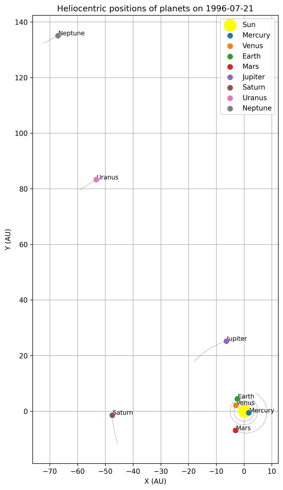

# Solar System Visualization on a Specific Date

This project allows you to **visualize the heliocentric positions of the planets** in the Solar System for any given date.  
The output can be generated either as a **Matplotlib plot** or as **pixel coordinates (CSV)** that can be imported into design tools like **Figma**.

---

## 🚀 Features
- Compute planetary positions using NASA JPL ephemerides.
- Generate **2D heliocentric map** of the Solar System.
- Export positions to **CSV** with pixel coordinates for design tools.
- Support for scaling and centering the system (e.g., for A3 printing or Figma layouts).

---

## 📦 Requirements

Python >= 3.8 and the following libraries:

